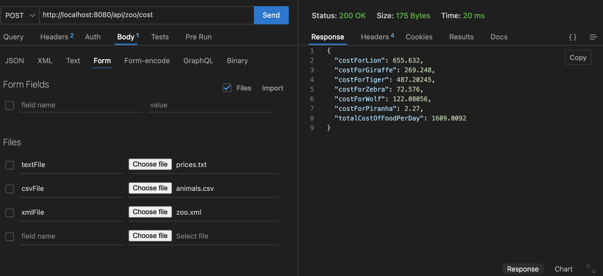

## Scania Test

### Cost of Zoo per day

## Run the app

Prerequisites: Java17, Maven

1. Start by building the app using command ```mvn clean install```
2. Run the app by using command ```java -jar target/ZooAssignment-0.0.1-SNAPSHOT.jar```


### request and response

This application has 2 endpoint

1> If usecase is for static input, that is 3 files given are the only files used for testing

Method: GET
URL: http://localhost:8080/api/zoo/cost
request: {}
response:
{
  "costForLion": 655.632,
  "costForGiraffe": 269.248,
  "costForTiger": 487.20245,
  "costForZebra": 72.576,
  "costForWolf": 122.08056,
  "costForPiranha": 2.27,
  "totalCostOfFoodPerDay": 1609.0092
}


2> If usecase is to take input from users

curl -X POST \
    -F "textFile=@/path/to/file" \
    -F "csvFile=@/path/to/file" \
    -F "zooFile=@/path/to/file" \
    http://localhost:8080/api/zoo/cost


###         OR

use post man to send post request as form data.
You can see the reference in img.png in the code




response:
{
  "costForLion": 655.632,
  "costForGiraffe": 269.248,
  "costForTiger": 487.20245,
  "costForZebra": 72.576,
  "costForWolf": 122.08056,
  "costForPiranha": 2.27,
  "totalCostOfFoodPerDay": 1609.0092
}


## This app is also hosted online if you want to test without deploying in local system.
## The system will take 2 to 3 min deploy when you clcik on the link. This is because it is deployed on a free service.

url : https://zooassignment.onrender.com/api/zoo/cost
